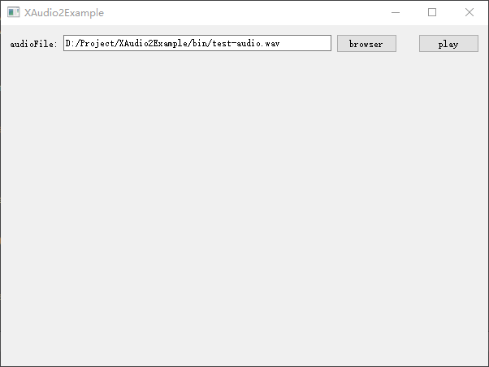

# XAudio2Example
Here is an example of playing audio using xaudio2, demonstrating how to open a wav audio and play it

##  build

This project depends on Qt, so first you should download and install Qt, the environment used is as follows:

- Qt 5.11.2 MSVC2015 64bit
- Windows 10
- XAudio2.9
- [audioFile](https://github.com/adamstark/AudioFile)

Other versions have not been tested

## use



it easy to use: 

```c++
QString audioFile = "D:/test.wav";
XAudioSound *pSoundPlay = new XAudioSound;
bool bResult = pSoundPlay->play(audioFile);
```

now you can hear the sound playing


## about author

- **kevinlq**  - [kevinlq](http://kevinlq.com/)
- **GitHub**  - [kevinlq](https://github.com/kevinlq)https://github.com/kevinlq 
- **Email:** kevinlq0912@gmail.com

####  If you think it is useful to you, welcome to Star and Fork, you can follow the public account


## refer to

- [Miscrosoft doc](https://learn.microsoft.com/en-us/windows/win32/xaudio2/xaudio2-introduction)
- [xaudio2 play pcm data](https://www.cnblogs.com/lidabo/p/6834925.html)
- [dounaite](https://www.dounaite.com/article/6256f0967cc4ff68e649d843.html)
